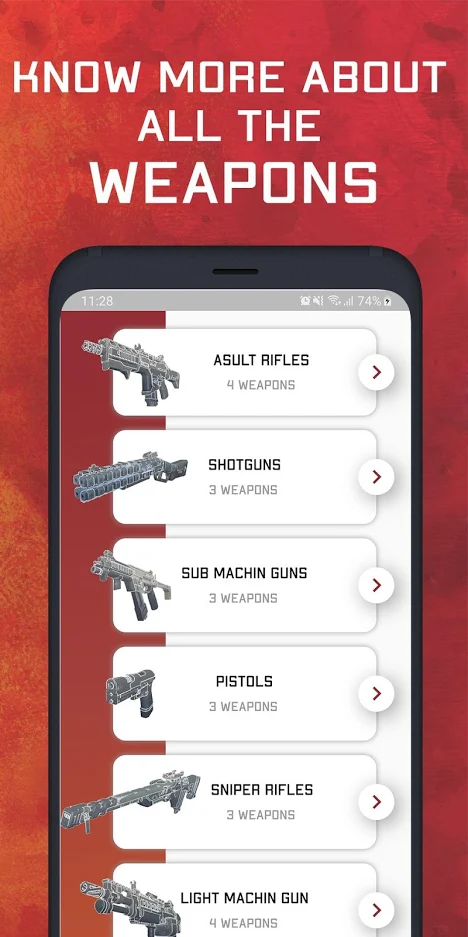
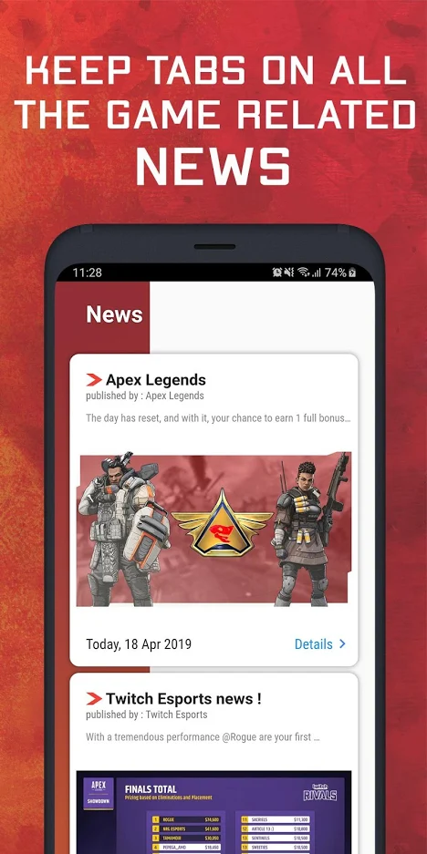
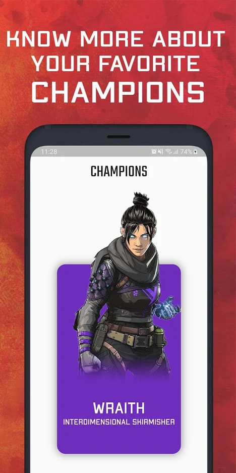
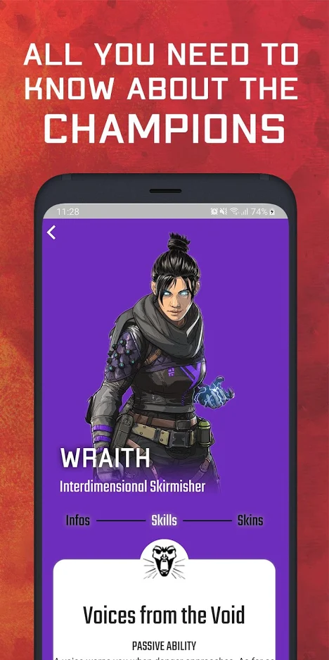

# Apex Companion

This is a project made for the "Apex Lengends" game.

## 📸 Screenshots
Screenshot1 | Screenshot2 | Screenshot3 | Screenshot4
:-------------------------:|:-------------------------:|:-------------------------:|:-------------------------:
 | |  | 

## Authors

* **Guerouchi Med Ali** - [MedAliG](https://github.com/MedAliG)
* **Skender Lahdhiri** - [Skenderl](https://github.com/skenderl)

## License

This project is licensed under the MIT License - see the [LICENSE.md](LICENSE.md) file for details